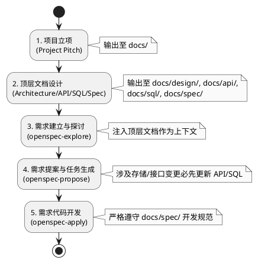

# tml-spec-coding 开发流程规范

## 0. 流程定义 (Process Definition)

**流程是什么**：基于 TML-Docs-Spec 和 OpenSpec 的 AI 辅助编码 (spec-coding) 标准开发流程，规范了从项目立项、架构设计、需求探索到代码生成的全生命周期，确保人类与 AI 在同一个上下文中协作。

**触发时机**：当有新项目立项或新需求进入开发阶段时。

**适用与例外**：适用于当前团队所有使用 AI Agent（如 OpenSpec）进行协助开发的项目。

## 1. 全局规则与红线 (Global Rules & Red Lines)

- **必须 (Must Do)**：
  - **文档先行**：Agent 进行架构设计、API 设计、SQL 设计时，必须分别输出到 `docs/design/`、`docs/api/`、`docs/sql/` 目录，并作为后续开发的权威参考标准。
  - **前置依赖更新**：涉及数据存储和接口变更的需求，在 `openspec-propose` 生成任务时，**必须**要求基于或先生成 API 文档（.yaml）和 SQL 文档（.sql），才能进行后续开发。
  - **遵守规约**：需求开发（`openspec-apply`）时，必须在指令中要求 Agent 参考 `/docs/spec/` 下的开发规范。
- **禁止 (Never Do)**：
  - 严禁在没有项目概念文档（`Project_Pitch_Spec`）的情况下直接开始需求开发。
  - 严禁绕过顶层文档（API/SQL/设计文档）直接让 AI 凭空生成实现代码。

## 2. 流程全景图 (Lifecycle Overview)

## 3. 阶段拆解：什么时候做什么 (Phases & Gates)

### 3.1 阶段一：项目立项

- **触发条件 (When)**：新项目决定启动。
- **动作与规则 (What & Rules)**：
  - 编写项目概念文档（Project\_Pitch\_Spec），存放在 `docs/` 目录下。
  - 向外界、AI 和团队阐明项目核心目标和业务背景。如果发现缺失该文档，必须强制补充。
- **责任人 (Who)**：项目发起人 / 产品经理。
- **流转关卡 (Gate)**：
  - ✅ **通过标准**：`docs/` 目录下存在清晰的项目概念文档。
  - ❌ **打回机制**：无概念文档拒绝进入设计和开发阶段。

### 3.2 阶段二：顶层文档设计

- **触发条件 (When)**：项目立项完成，准备进入具体模块或需求开发前。
- **动作与规则 (What & Rules)**：
  - **架构与领域设计**：视项目规模，在 `docs/design/` 和 `docs/design/domain/` 产出架构和领域设计文档，作为核心知识载体。
  - **存储与接口设计**：在 `docs/sql/` 生成数据表结构（`.sql`），在 `docs/api/` 生成接口定义（`.yaml`）。这是最权威的参考，后续代码对接以此为准。
  - **开发规范**：在 `docs/spec/` 下确立前后端开发规范（如 `前端开发规范.md`），作为 Agent 开发前的必读约束。
- **责任人 (Who)**：架构师 / 核心开发者。
- **流转关卡 (Gate)**：
  - ✅ **通过标准**：核心架构、API、SQL 和开发规范（`docs/spec/`）文档已就绪。

### 3.3 阶段三：需求建立与探讨

- **触发条件 (When)**：新需求进入分析与细化阶段。
- **动作与规则 (What & Rules)**：
  - 使用 `openspec-explore` 探索需求。
  - **必须提供上下文**：将顶层文档（架构设计、领域设计、API 文档、SQL 文档）提供给 AI，以确保需求分析不偏离项目基建。
- **责任人 (Who)**：产品经理 / 开发者。
- **流转关卡 (Gate)**：
  - ✅ **通过标准**：需求边界与技术可行性清晰，所有疑问已通过 explore 解决。

### 3.4 阶段四：需求提案与任务生成

- **触发条件 (When)**：需求探索完毕，准备生成可执行任务（Tasks）。
- **动作与规则 (What & Rules)**：
  - 使用 `openspec-propose` 提交需求并生成提案。
  - **顺序约束**：如果需求涉及存储层（表结构）或 API 的变更，**必须要求** **`openspec-propose`** **在生成任务时，先生成或更新 API 文档和 SQL 文档**，然后才能进行后续 API/逻辑代码的开发。
- **责任人 (Who)**：开发者。
- **流转关卡 (Gate)**：
  - ✅ **通过标准**：OpenSpec 成功生成包含 proposal、specs、design、tasks 的变更提案，且关联的 API/SQL 文档已同步更新。
  - ❌ **打回机制**：若任务列表中未体现 API/SQL 的前置更新步骤，打回重新 propose。

### 3.5 阶段五：需求代码开发

- **触发条件 (When)**：提案和任务已生成并确认无误，进入编码阶段。
- **动作与规则 (What & Rules)**：
  - 使用 `openspec-apply` 进行任务开发。
  - **强制约束**：必须在 prompt 中明确要求 OpenSpec 参考 `/docs/spec/` 文件夹下的开发规约（Dev\_Guidelines\_Spec）进行代码生成。
- **责任人 (Who)**：开发者（协同 AI Agent）。
- **流转关卡 (Gate)**：
  - ✅ **通过标准**：所有 tasks 完成，代码符合 `/docs/spec/` 规范并能正常运行。

## 4. 异常降级与中断 (Exception Handling)

- **AI 幻觉或代码严重偏离规范**：如果在 `openspec-apply` 阶段发现 AI 生成的代码未遵守 `docs/spec/` 规范，或自行捏造了 API/SQL 结构：
  1. 立即中断 `openspec-apply` 流程，放弃当前变更。
  2. 检查 `docs/design/`、`docs/api/`、`docs/sql/` 中的上下文是否缺失或存在歧义。
  3. 补充或修正顶层文档后，重新使用 `openspec-explore` 澄清上下文，并重新走 propose 流程。
- **底层架构冲突**：如果在需求探讨阶段（explore）发现当前架构或数据库设计无法支撑新需求，必须挂起当前需求，先发起一个专门针对 `docs/design/` 或 `docs/sql/` 的变更流程。

## 5. Agent 工具链与上下文依赖 (Agent Toolchain & Context Dependencies)

| 阶段   | 自动化工具/指令           | 必须挂载的上下文 (Context)                       | 预期输出目标                                          |
| :--- | :----------------- | :--------------------------------------- | :---------------------------------------------- |
| 需求探讨 | `openspec-explore` | `docs/design/`, `docs/api/`, `docs/sql/` | 澄清需求边界，确认技术可行性                                  |
| 提案生成 | `openspec-propose` | 探讨结论、当前 `.sql` / `.yaml` 文件              | 变更提案 (proposal/specs/tasks)、**更新后的 API/SQL 文档** |
| 任务执行 | `openspec-apply`   | `docs/spec/` (开发规范)、变更提案                 | 实现代码、单元测试                                       |

